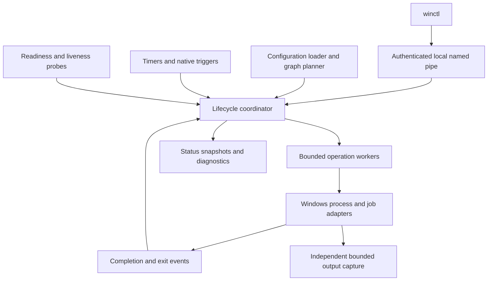

# winunitd design — revision 2

September 5, 2026; status refreshed September 9, 2026. Target architecture for
the [roadmap](ROADMAP.md), based on the [architecture review](docs/DESIGN-REVIEW.md).
This supersedes [revision 1](docs/archive/DESIGN-v1.md). The published `0.2.1-beta`
implements a narrower supported contract; this document specifies intended
behavior, not the shipped unit-file reference. Use [UNIT-REFERENCE.md](docs/UNIT-REFERENCE.md)
and [RUNTIME-REFERENCE.md](docs/RUNTIME-REFERENCE.md) for current behavior, and
[milestones](docs/MILESTONES.md) and [post-beta tracking](docs/POST-BETA-TRACKING.md)
for remaining implementation and qualification. Existing beta syntax remains
compatible until an explicit versioned migration is designed and accepted.

## 1. Purpose and boundaries

winunitd supervises cooperating Windows background processes. It provides declarative lifecycle, dependency ordering, bounded recovery, scheduling, user execution, and diagnostics. Windows supplies SCM, security tokens, sessions, filesystem security, and Job Objects. Existing services and tasks remain owned by their native managers.

Go remains the implementation language. Keep the portable policy core and small Windows API adapters; no rewrite or second implementation language is planned. Managed workloads are trusted to the extent of their execution identity. Job Objects provide process containment, not a security sandbox or ownership of work delegated to an external broker.

One system manager runs as an SCM service. A background user manager runs under its user's token, with at most one managed instance per SID. A manager failure may stop its owned workloads through kill-on-close; SCM or the user host recovers the manager. Restart boots enabled units, not an inferred reconstruction of every manually started process. Multi-manager fault isolation and GUI session executors are deferred.

## 2. Architecture and ownership

Each manager has one serialized coordinator. Only that coordinator changes lifecycle state, operation ownership, restart eligibility, and accepted configuration pointers. The system manager also coordinates per-SID manager instances through the same operation-generation discipline. Blocking OS work, token acquisition, parsing, probes, persistence, and log output run outside the coordinator.

Keep existing packages. `core` defines lifecycle transitions and graph plans; `manager` hosts the coordinator; `runtime` owns Windows handles and execution; `unit` produces validated configuration; `timers` and native watchers produce events; `journal` owns capture/storage; `protocol` owns transport and authorization. Adapters report observations and typed errors instead of mutating manager records.

The R2 end-state is a mutex-serialized set of decision handlers, not a required
single-goroutine event loop. The lock is the serialization mechanism; the audited
handler set is the sole authority. Handlers validate identity, update records and
return retained effects. They do not wait for unit gates, workers, process I/O,
client contexts or persistence. Workers perform those effects and deliver results
through the same handlers. A future event loop is optional, not a second migration
gate. User-host instance handlers follow this discipline; their remaining session
policy and integration with system-manager admission remain explicit audit items.

Commands acquire bounded admission slots before allocating worker work; a bounded
queue is optional. Reject excess control work with an explicit busy result. Worker
concurrency is bounded. Completion/exit delivery bypasses command admission and
must retain reserved capacity under overload; coalesce replaceable notifications.
Stop and maintenance retain independent admission/precedence. A handler must never
wait synchronously for a worker whose completion needs the same authority.
Removing scattered writers alone cannot close R2: R2.3 additionally requires
measured overload/completion progress and bounded work for every operation class,
and R2.1 still requires immutable aggregate snapshots.

## 3. Records and invariants

| Record | Responsibility |
| --- | --- |
| ConfigRevision | Immutable validated unit definitions and graph; revision ID and diagnostic results |
| UnitRuntime | Stable unit identity, load state, observed lifecycle, health, pending operation, active invocation, restart budget |
| Invocation | Unique ID, captured configuration revision, process/job ownership, start/exit facts, output capture, readiness |
| Operation | ID, unit generation, action, deadline, origin, cancellation state, and result |
| Transaction | Immutable graph plan plus operation results; never a second writable copy of unit lifecycle state |

The following invariants are release requirements:

1. Every launched process/job has one owner until termination is confirmed and owned handles are released. Configuration reload never removes that ownership.
2. There is at most one owned live invocation per unit name and manager. A unit name cannot be reused around an untracked old invocation.
3. Only events matching the current operation/generation may change current lifecycle state. Stale completions still clean up any resources they created.
4. An accepted stop or maintenance operation disarms recovery for its scope before teardown. Late exit, probe, timer, and launch results cannot resurrect it.
5. Independent units may perform I/O concurrently; dependency ordering gates their lifecycle transitions.
6. Output drain begins before waiting for readiness or oneshot exit and remains independent of activation success.
7. Status distinguishes configuration, process state, application health, and the last operation's outcome. A successful stop requires confirmed termination, not merely a sent kill request.

## 4. Commands, transactions, and cancellation

Start validates a plan against one configuration revision before side effects. `Wants` and `Requires` select dependencies; `After` and `Before` order selected jobs. Track each result as it arrives. Failure does not silently undo already successful starts. Return partial results and dependency explanations so the operator can see what remains active.

Coalesce compatible starts of the same unit. An accepted stop cancels pending activation/restart and takes precedence for that unit. Restart is one coordinated operation: snapshot participating active/activating units, stop the required set in reverse order, then start the restart set in forward order. Do not implement it as two unrelated public RPC calls. `PartOf` participates in that set even when the root does not also `Want` the member.

Operation records outlive an RPC connection. After acceptance, client disconnection cancels only the wait for a response; it does not leave an ambiguous half-owned process. Internal operation deadlines, explicit stop, and maintenance control cancellation. Return operation IDs and expose outcomes through status/query. Preserve the synchronous CLI experience by waiting on that operation; evolve the protocol version deliberately when schemas become incompatible.

Timers and native watchers submit activation requests with their origin. They do not masquerade as an operator start that resets restart budgets. Define one shared rate limit for attempted activations and distinguish automatic restart from a new requested run. Limits, backoff, and maintenance suppression apply before spawning work.

## 5. Configuration and reload

Retain systemd-shaped INI, strict unknown-directive errors, literal environment values, and absolute executable paths. Prefer an explicit executable with repeated arguments or a JSON argv array. Shell execution requires an explicit shell executable. Do not infer command syntax from filesystem existence. Validate configuration independently of whether the target executable currently exists; existence/access checks are separately reported validation and activation results.

Introduce an explicit unit-format version before changing ambiguous semantics. Unversioned files retain the documented beta interpretation during migration; a converter/validator reports required changes and writes an explicit new version only on request. No silent AND-to-OR or CPU-unit conversion on reload or MSI upgrade. Resolve exact syntax and conversion rules in R3 before enabling new semantics in production.

Parse and validate a full candidate revision outside the coordinator. Reject invalid replacements atomically and keep the last accepted revision, reporting all diagnostics. A cold load with invalid configuration exposes diagnostics and control but starts no units from an unaccepted revision. A valid removal is allowed: keep any live runtime as `not-found` load state with its captured invocation configuration, status, logs, and stop capability. Removal disarms future automatic restart and activation for that unit. Once stopped, it cannot start until a valid definition returns.

For a valid changed definition, the running invocation keeps its captured configuration. Explicit restart uses the latest accepted revision. Automatic recovery of that invocation continues with its captured revision; status shows when the accepted definition differs. Unit-kind changes with a live invocation require stop before replacement. Plans already accepted retain their revision, and new plans use the new revision. Reload alone never starts or stops a workload.

## 6. Process lifecycle and stop

The launcher creates a suspended process, assigns its Job Object and resource policy, installs output handling, and resumes it. It returns an owned process handle promptly. The manager, not the launcher, implements readiness and oneshot completion. Main-process exit triggers teardown of remaining owned descendants before replacement. Unowned external services are handled only by their adapters.

The SYSTEM broker's root job permits explicit breakaway for cross-session user
launches. Windows jobs cannot span sessions. Such a launch atomically joins a
separate kill-on-close job using `PROC_THREAD_ATTRIBUTE_JOB_LIST`; the broker
retains its sole noninherited handle. A broker crash therefore also tears down
that user tree, including a child whose launch has not returned. Same-session
managers retain outer-job membership. Unit and user-manager jobs prohibit
breakaway, so the broker exception does not relax workload containment.

Lifecycle states remain inactive, activating, active, deactivating, and failed, with explicit substates and termination uncertainty.
The existing beta manager uses `step` for process lifecycle events and a separate,
identity-checked `publishStartOutcome` for explicit member results, including
non-process starts and never-launched rejections. Publication produces active/running,
inactive/no-substate, or failed/no-substate; an already failed watchdog retains its
watchdog cause. The handler guards apply before publication, and transaction
snapshots are never publication inputs. This is a documented transition adapter,
not a second lifecycle authority. Health is separate: unknown, ready, degraded, or unhealthy. A process may be running while not ready. A successful oneshot normally becomes inactive with a successful last result; `RemainAfterExit=yes` explicitly retains active state.

Stop uses a deadline shared across the operation's phases:

1. Suppress automatic recovery and cancel readiness/trigger activity for the affected scope.
2. Run configured `ExecStop` under the workload's identity and captured configuration. It has its own tracked helper job and remaining deadline; it cannot obtain additional privilege through the system manager.
3. Wait for the workload to exit within the remaining graceful budget. If no cooperative stop is configured, use documented forced-stop behavior immediately.
4. Force termination of the owned job, wait for confirmation within the overall budget, and bound capture finalization.

Cleanup obligations are tracked independently for workload, notification, watch
and stop-helper resources. Completion of one helper/process cannot clear another
resource's uncertainty. Stop-helper output finalization retains the same helper
owner until joined. See the unit reference for implemented command restrictions;
the broader R3.2 conformance and native qualification gates remain open.

Reserve part of the total deadline for forced termination and confirmation; the cooperative phase cannot consume the entire budget. Do not discard kill/wait/close errors. If termination cannot be established, retain ownership and failed/stopping diagnostics, refuse a replacement invocation, and fail maintenance. Console CTRL_BREAK and GUI messages remain deferred until a compatible console/session arrangement is implemented and tested; `CREATE_NEW_PROCESS_GROUP` alone is insufficient.

## 7. Compatibility and health contract

This table defines v2 targets, not current support. Upstream comparisons and source references are preserved in the [review](docs/DESIGN-REVIEW.md#5-copy-systemd-concepts-with-an-explicit-compatibility-contract).

| Feature | Target contract |
| --- | --- |
| `Requires`, `Wants`, `After`, `Before` | Preserve separation of activation requirement and ordering; document conditional start-failure behavior and explicit stop propagation |
| `BindsTo` | Stop a running bound dependent when its required peer unexpectedly disappears; with `After`, enforce active-state dependency; no implicit restart of dependents unless requested by policy |
| `PartOf` | One-way stop/restart propagation; starting the parent alone does not imply starting every member |
| `Type=simple` | Process creation/assignment succeeds; no application readiness claim |
| `Type=notify` | Activation completes on authenticated readiness for the current invocation or fails on deadline/exit |
| `Type=oneshot` | Activation waits for exit while draining logs; default completed/inactive, optional `RemainAfterExit` |
| `PathExists` | Repeated predicates use OR in the new format; any AND facility gets an explicit distinct operator/name |
| CPU controls | Use explicit Windows names/ranges for native job quota and weight; quota is relative to a CPU-controlled parent job when nested, otherwise machine capacity; migration preserves effective limits or rejects lossy conversion |
| Native proxies | Report external ownership/capabilities; no claimed job containment or restart/watchdog coverage beyond the adapter |
| Unsupported directives | Reject; no partial acceptance of unimplemented safety or lifecycle guarantees |

R3 publishes a versioned reference covering start, stop, restart, natural exit, skip, and failure for each relationship, plus exact new directive names/defaults. Narrow or reject a feature that cannot pass that contract; do not retain familiar syntax with unexplained partial behavior. Legacy-format support is transitional and explicitly identified; legacy limitations do not qualify as v2 conformance.

Readiness gates dependent startup. Liveness controls recovery after activation. Support application readiness endpoints and existing notify; identify TCP connection checks as weaker evidence. Configure startup grace, probe timeout, consecutive-failure threshold, and restart backoff/cap. Their defaults and syntax are fixed in the R3 reference. Probes carry invocation IDs; stale responses cannot ready or kill a replacement. A health degradation does not restart a process unless its configured liveness policy requires it.

## 8. Windows identities and privileged boundaries

Maintain a per-SID user-host record containing eligible sessions, selected token source, generation, manager process, recovery budget, and stopping state. Reconcile logon/logoff and process-exit events through that record. Relaunch with a fresh suitable token, bounded backoff, and cancellation checks. Interactive admission defaults to administrator-enabled users. An optional administrator-selected mode delegates admission to the presence of user unit files; explicit per-SID disable takes precedence. File presence admits the user manager, not arbitrary workload activation or headless linger. Apply the [user admission policy](docs/USER-ADMISSION.md), including bounded probes, revocation, and independent explicit linger grants.

Distinguish interactive-token background operation from headless boot-time linger. A later logon does not silently replace a running linger manager's identity/environment. Record the chosen mode; an explicit manager restart is required to adopt a new mode. Unsupported credential requirements fail visibly rather than weakening authentication.

Use Windows profile, known-folder, and environment facilities for the target user. Load/unload profiles with explicit lifetime ownership where needed. Do not synthesize redirected folders or copy arbitrary LocalSystem environment entries. Apply documented explicit unit overrides after constructing the user's baseline environment. Test local/API credentials separately from Windows-integrated remote credentials.

Cross-session process creation must obey Windows handle inheritance rules. Arrange standard handles in the child/session or through a qualified bootstrap, with no blanket parent-handle inheritance. R4 selects and tests the concrete launch mechanism under real SYSTEM; a same-session test is insufficient.

Keep token operations in narrow, thread-correct Windows adapters. User configuration never becomes a privileged command. Machine unit directories require administrator/SYSTEM write control. Retain named-pipe DACLs, token authorization, server-owner validation, and remote-client rejection. Define threat cases for pipe squatting, reparse points, inherited handles, and cross-user access. Job limits do not replace access-token security.

## 9. Scheduling, logging, and persistence

Use monotonic time for delays and calendar time for civil schedules, with explicit clock-change and resume reconciliation. Persist timer activation records using validated atomic replacement. Distinguish missing state from corruption and surface every persistence failure.

For persistent calendar timers, coalesce missed occurrences into one catch-up activation. Record a pending activation before dispatch and its result afterward; recover a pending interrupted activation as one retry. This allows duplicate execution after a crash and requires idempotent workloads. If a required durable write fails, suspend that timer's dispatch with diagnostics until persistence is restored; do not silently claim persistence. Reconciliation with an already active service coalesces activation rather than spawning another instance. Existing-format migration is explicit. Other timer types retain separately documented monotonic semantics.

Bound log records, per-invocation queues, total manager buffering, and retention. Chunk overlong/no-newline output with explicit continuation metadata. On slow/full storage, keep draining the child, discard within the defined bounded policy, and expose dropped-byte/record counts and storage errors. Do not block lifecycle on a slow journal. Preserve stream identity; do not infer error severity solely from stderr. Version journal schema changes and retain backward readers.

Persist configuration/enablement/linger and timer intent; runtime PIDs are observations, not crash-recovery ownership evidence. Atomic writes must be tested on supported Windows filesystems. No database dependency is required for this iteration.

## 10. SCM, maintenance, installation, and diagnostics

Report SCM StartPending until configuration processing, coordinator initialization, and authenticated control-listener binding complete. Invalid workload configuration can produce a running, degraded manager with diagnostics; an unbound control endpoint cannot report ready. Capture daemon startup failures durably and through a properly installed Windows event source.

Maintenance is a manager-wide barrier: reject new mutations that start work, disarm triggers/recovery, cancel in-flight launches, gracefully stop user managers and units, and verify owned process/handle release within one deadline. Preserve read-only diagnostics. Late completions must clean up their processes. If the deadline expires, report failure and let the installer abort/rollback rather than replacing live files.

Use machine-wide x64 WiX/MSI with MSI-owned files, service, PATH, and event registration. Preserve mutable machine/user data on repair, upgrade, and uninstall. Keep migration from Task Scheduler explicit, reversible, and outside generic package customization. The [installer plan](docs/MSI-INSTALLER-PLAN.md) defines component identity, version mapping, ACLs, rollback, and signing. Public signing follows the roadmap; no installer claims are inferred from these documents.

Status exposes accepted and invocation configuration revisions, operation/invocation IDs, ownership type, load/lifecycle/health state, PID/session/token-source facts where appropriate, last exit/stop errors, restart limits, pending deadlines, and storage degradation. Return sanitized structured data; exclude credentials and environment values. Add bounded protocol responses and deliberate version negotiation. Logs and operation outcomes must remain accessible for removed-but-live units.

## 11. Verification and incremental delivery

Keep Linux policy tests and Windows adapter tests. Add invariant-based operation sequences, fake-clock schedules, parser/protocol fuzzing, and real-process regressions for output/reload/termination. Bound test resources and isolate endpoints so tests cannot operate on the installed pilot.

Before release, qualify real SCM startup, SYSTEM-to-user sessions, non-admin control, logoff/reboot, cross-session handles, profile environments, storage failure, and MSI rollback in disposable Windows VMs. Record actual OS/token context; skips do not count as passes. Pin the maintained release compiler separately from minimum language compatibility and record all release tool versions.

R1 fixes urgent defects in the current architecture with durable regression tests. R2 introduces the coordinator behind existing APIs and migrates every mutation path before removing old state writers. Later milestones implement the compatibility and Windows contracts, preserving tests and adapters. No dual lifecycle authorities may remain after R2. The [milestone gates](docs/MILESTONES.md) are the evidence required to call this design implemented.
